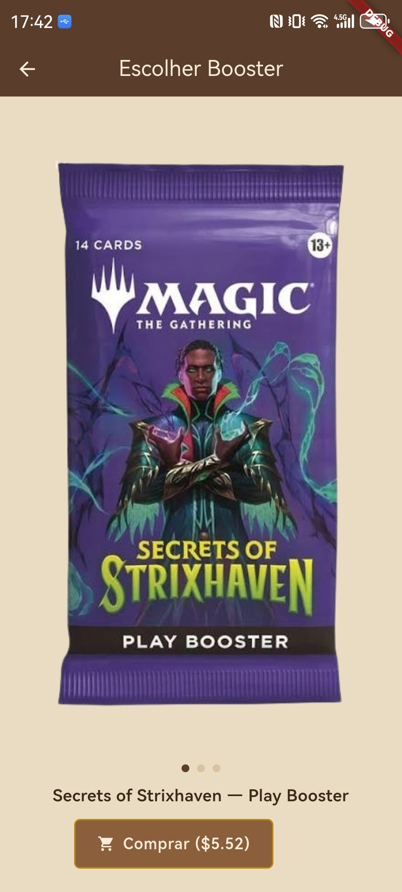
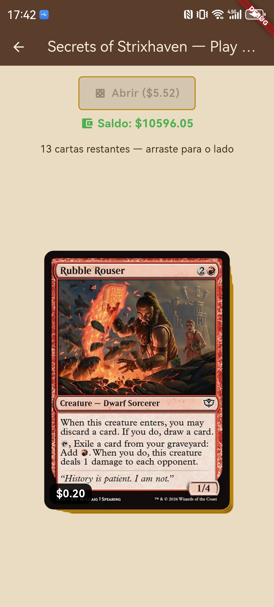
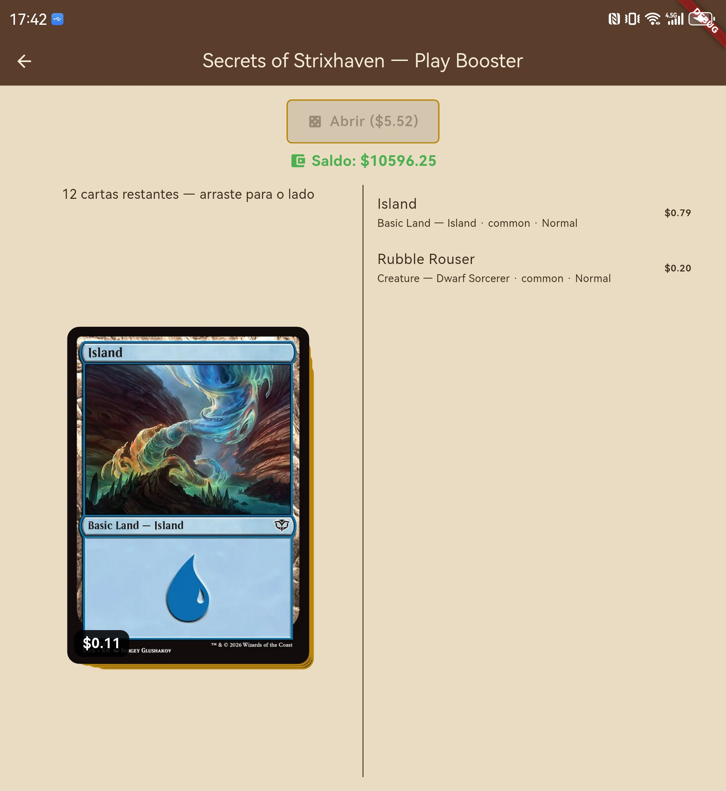
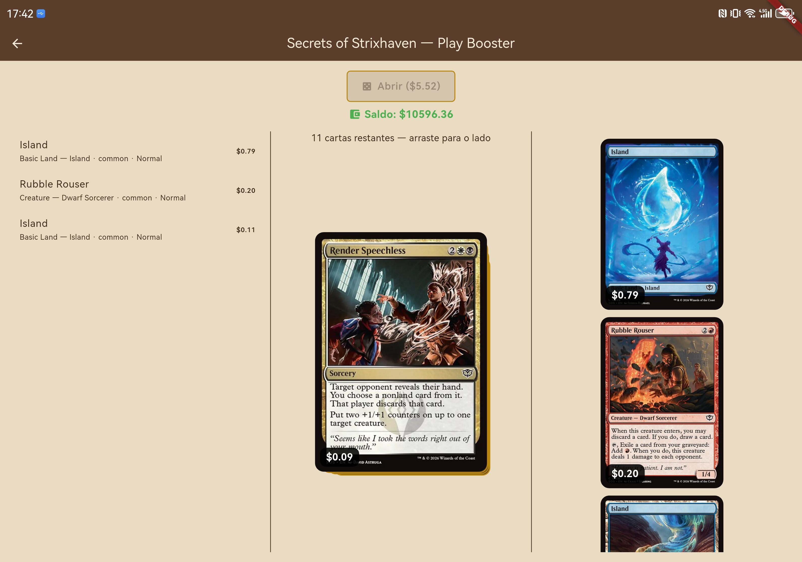
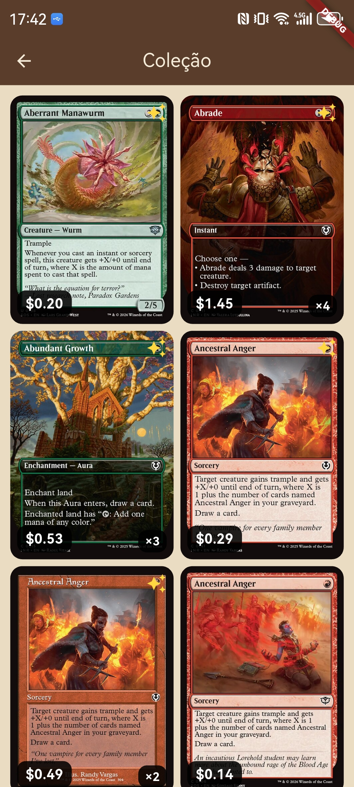
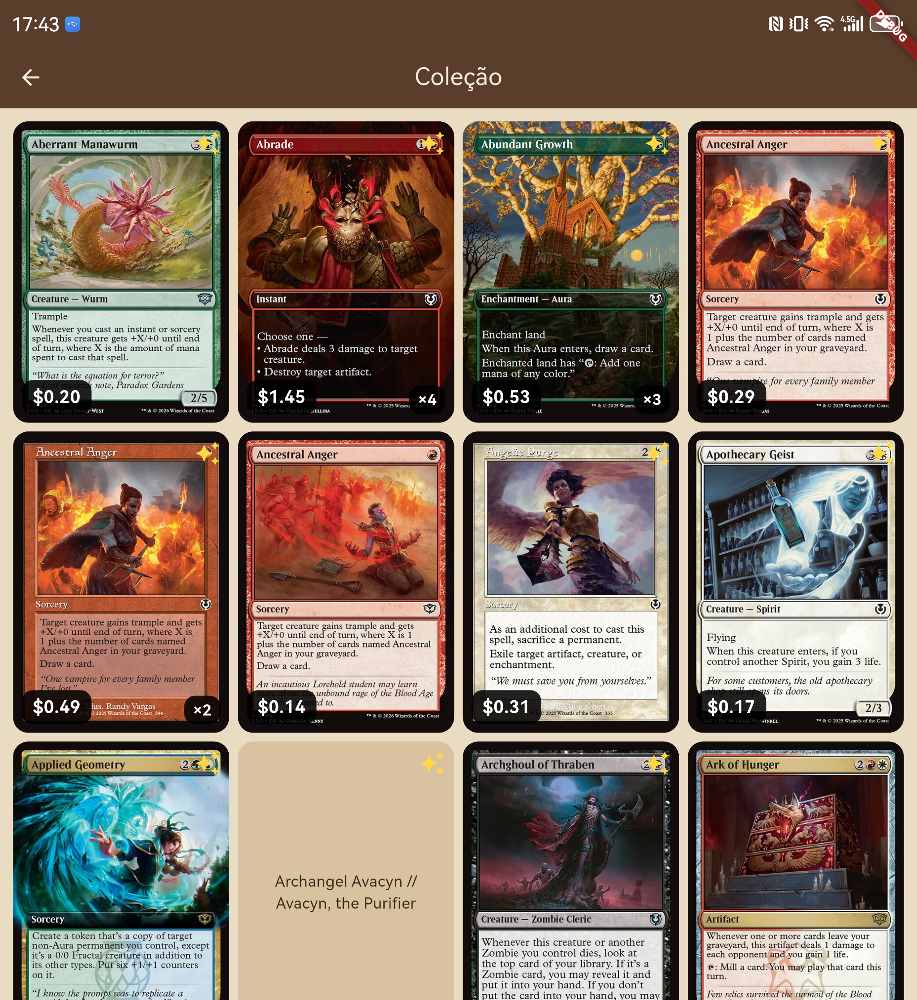
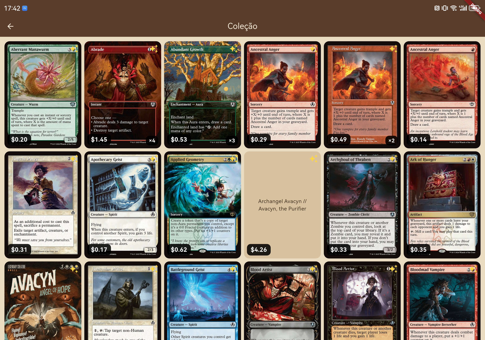

# MTG Collector (MTGC)

Aplicativo móvel para **simular a abertura de boosters de Magic: The Gathering** e
gerenciar a coleção de cartas obtidas. O usuário compra e abre pacotes (Play e
Collector), revela as cartas com uma animação de "swipe", e cada carta aberta é
registrada na sua coleção no servidor. As cartas, imagens e preços vêm da API
pública da **Scryfall**.

---

## Problema e solução

- **Problema:** abrir boosters físicos de Magic é caro e o colecionador não tem
  uma forma simples de simular aberturas e acompanhar o valor/coleção resultante.
- **Público-alvo:** jogadores e colecionadores de Magic: The Gathering.
- **Solução:** um app que simula a abertura de boosters usando as probabilidades
  reais de cada slot (ver [`mtgc/docs/mtg-boosters.md`](mtgc/docs/mtg-boosters.md)),
  credita/debita uma carteira virtual conforme o valor das cartas, e persiste a
  coleção do usuário em um backend próprio. A interface se adapta a telas
  dobráveis (Huawei Mate XT), aproveitando múltiplos painéis.

---

## Capturas de tela

**Escolha e abertura de booster (1 tela)**

<p>
  
  
</p>

**Abertura em telas dobráveis (Huawei Mate XT) — 2 e 3 telas**

<p>
  
  
</p>

**Coleção — 1, 2 e 3 telas (2 / 4 / 6 colunas)**

<p>
  
  
  
</p>

---

## Tecnologias utilizadas

| Camada | Tecnologia |
|---|---|
| App mobile | **Flutter / Dart** |
| Backend | **FastAPI** (Python) |
| Banco de dados | **PostgreSQL** (via `asyncpg`) |
| Autenticação | **JWT** (PyJWT) + senhas com **bcrypt** |
| API externa | **Scryfall** (`https://api.scryfall.com`) |
| Armazenamento local | `shared_preferences`, `flutter_secure_storage` (token JWT) |
| HTTP | pacote `http` |

---

## Arquitetura

```
MTGCollector/
├── mtgc/        # App Flutter (cliente)
│   ├── lib/
│   │   ├── pages/      # Telas: login, menu, seleção, booster, coleção
│   │   ├── services/   # api_client, scryfall, wallet, auth_storage, ...
│   │   ├── models/     # MtgCard, BoosterProduct, CollectionEntry
│   │   └── ui/         # layout_metrics (telas dobráveis), card_detail
│   └── docs/           # Notas sobre boosters e a API Scryfall
└── server/      # API FastAPI + Postgres
    ├── main.py
    └── schema.sql
```

**Fluxo principal:** Login/Cadastro → Menu → Seleção de booster → Abertura e
revelação das cartas → cartas registradas na coleção (servidor) → Coleção em
grade responsiva.

### Telas (navegação)

`AuthGate` decide entre **Login** e **Menu**. A partir do **Menu** o usuário
navega para **Seleção de Booster** → **Booster** (abertura) e para a **Coleção**.
São mais de duas telas com navegação funcional (`Navigator` / `MaterialPageRoute`).

### Backend / Banco de dados

API FastAPI com PostgreSQL. Tabelas `users` e `cards` (ver
[`server/schema.sql`](server/schema.sql)); o schema é aplicado automaticamente na
inicialização. Endpoints:

| Método | Rota | Auth | Descrição |
|---|---|---|---|
| GET | `/health` | — | healthcheck |
| POST | `/auth/register` | — | cadastro, retorna `{token}` |
| POST | `/auth/login` | — | login, retorna `{token}` |
| GET | `/collection` | Bearer | lista a coleção do usuário |
| POST | `/collection/cards` | Bearer | registra cartas abertas |


### API externa (Scryfall)

O app busca o pool de cartas de um set e suas imagens/preços na Scryfall
(`mtgc/lib/services/scryfall.dart`).

---

## Instruções de execução

### Pré-requisitos

- Flutter SDK (canal estável) e um emulador/dispositivo.
- Python 3.12+ e PostgreSQL (ou Docker).

### 1. Backend (`server/`)

```bash
cd server
# Postgres local via Docker (opcional):
docker run -d --name mtgc-pg -e POSTGRES_PASSWORD=pg -p 5432:5432 postgres:16

python -m venv .venv && . .venv/bin/activate
pip install -r requirements.txt          # ou requirements-dev.txt para rodar testes
export DATABASE_URL="postgresql://postgres:pg@localhost:5432/postgres"
export JWT_SECRET="dev-secret"
uvicorn main:app --reload                # sobe em http://localhost:8000
```

Variáveis de ambiente: ver [`server/.env.example`](server/.env.example).
Deploy (Railway) documentado em [`server/README.md`](server/README.md).

### 2. App (`mtgc/`) — rodar em um celular físico (Android)

1. No celular, ative as **Opções de desenvolvedor** e a **Depuração USB**
   (Configurações → Sobre o telefone → toque 7× em "Número da versão"; depois
   Opções de desenvolvedor → Depuração USB).
2. Conecte o celular ao computador por **cabo USB** e, na primeira vez,
   **autorize a depuração** no pop-up que aparece no aparelho.
3. Confirme que o Flutter reconhece o dispositivo:

   ```bash
   flutter devices
   ```

   O celular deve aparecer na lista com um id (ex.: `ABC123XYZ`).
4. Instale as dependências e rode o app **no celular**, usando o id do passo
   anterior:

   ```bash
   cd mtgc
   flutter pub get
   flutter run -d <id-do-dispositivo>
   ```

   (Em um emulador, `flutter run` sem `-d` também funciona.)
5. No primeiro acesso, na tela de **Login**, toque em **"Configurar servidor"** e
   cole o **link público do servidor** (o domínio do Railway, ex.:
   `https://seu-app.up.railway.app`). Para um servidor local acessado pelo
   emulador Android, use `http://10.0.2.2:8000`.
6. Cadastre-se / faça login e use o app.

---

## Documentação por pasta

Além deste README, cada pasta tem sua própria documentação:

- [`mtgc/README.md`](mtgc/README.md) — notas do app Flutter.
- [`mtgc/docs/mtg-boosters.md`](mtgc/docs/mtg-boosters.md) — como funcionam os
  boosters de MTG (regras e probabilidades de cada slot).
- [`mtgc/docs/scryfall-api.md`](mtgc/docs/scryfall-api.md) — uso da API externa
  Scryfall.
- [`server/README.md`](server/README.md) — API FastAPI: endpoints, execução
  local e deploy.

---

## Uso de IA

Ferramentas de IA foram utilizadas **como auxílio** na construção deste projeto,
especificamente em:

- redação e organização da documentação (este README e os READMEs específicos de
  cada pasta, listados acima);
- pesquisa e referência da **API externa** (Scryfall);
- pesquisa do **funcionamento dos boosters** de Magic: The Gathering (regras e
  probabilidades de cada slot).

A implementação e as decisões finais foram revisadas pelo autor.
